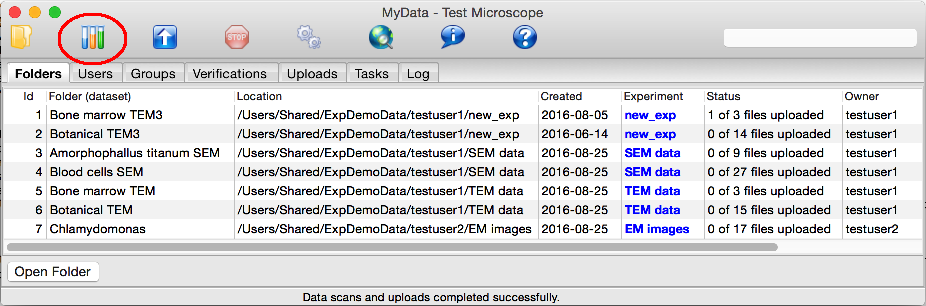
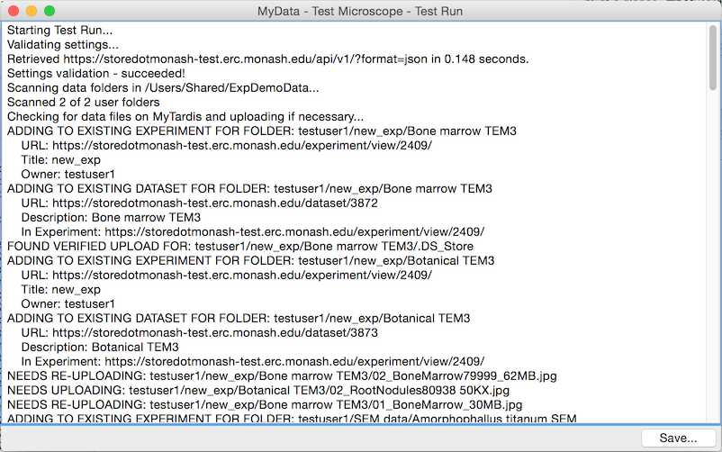
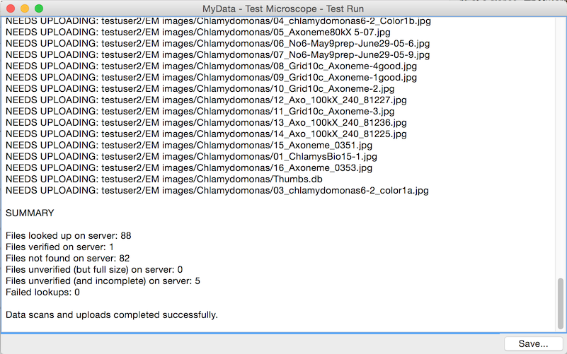

Test Run
========

MyData's Test Run can give you a preview of what data would be uploaded before
you begin uploading the data.  This is particularly useful because MyTardis
doesn't allow deleting of uploaded data, except by site administrators, so
instead of trying a real upload, getting it wrong, and having to ask for
help with cleaning up the unwanted data, you can do a practice run first.

The Test Run can be launched from the "Test Tubes" icon on MyData's toolbar:

The first part of the Test Run output shows the results of MyData's initial
settings validation and data folder scanning.

This is followed by a list of the experiments and datasets which would be
created (or added to), and a list of the files which would be uploaded:

The Test Run output finishes with a summary of the number of files which
need to be uploaded.

The Test Run output can be saved to a text file for viewing in an external
application.
