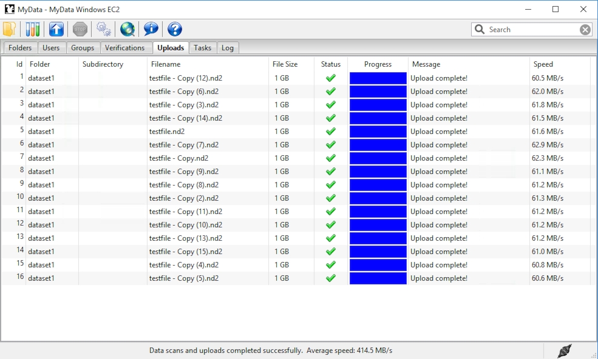

Upload Speed
^^^^^^^^^^^^

How fast is MyData?

This page lists the key considerations for achieving faster uploads
with MyData.

An example of MyData running faster than Gigabit speeds is shown below:

An overall upload speed of 414.5 MB/s was achieved by MyData v0.7.0-beta1
while uploading sixteen 1 GB files.  MyData was configured to run with
concurrent 8 upload threads on an Amazon EC2 Windows virtual machine
with 8 CPU cores, and was uploading to an Amazon EC2 Ubuntu virtual
machine, also with 8 CPU cores, using MyData's SCP upload method.
The upload speed per SSH channel is not impressive, and suggests that
perhaps SCP is not taking advantage of hardware-accelerated encryption
(AES-NI) on the Windows client.  However the overall speed (with 8
upload threads) is not too bad.  The "Average speed" displayed at the
bottom (414.5 MB/s) was calculated from the total elapsed time, including
the time taken to calculate an MD5 sum before each upload, which is
relatively fast on modern CPUs.  The Amazon EC2 virtual machines had
*Intel(R) Xeon(R) CPU E5-2676*  CPUs.

Upload Methods
--------------

MyData currently offers two upload methods: POST (to MyTardis) and SCP.
Upload methods which may be offered in the future include globus-url-copy,
Robocopy to Samba/CIFS, and POSTing to object storage (S3 / Swift).

POST (to MyTardis ) can be used with either HTTP or HTTPS, with HTTPS being
recommend for all production MyTardis servers.  The POST protocol can perform
very well, e.g. for uploads to S3 object storage, but the POST uploads offered
by MyTardis are usually restricted to small files due to server memory usage of
Django / TastyPie / gunicorn.  Furthermore, POST uploads from MyData don't
allow concurrent upload threads because the "poster" Python module being used
to display upload progress is not thread-safe.

SCP is the recommended upload method for MyData currently.  Because of the
current restrictions on POSTing large files to MyTardis, this document will
focus exclusively on optimizing upload speed using the SCP upload method.

SCP Server Load
---------------

Overview
~~~~~~~~

Modern top-of-the-line CPUs can encrypt and decrypt very quickly, but you
shouldn't assume that your CPUs can encrypt / decrypt at wire speed, especially
if the number of concurrent SCP uploads your server is handling is greater than
the number of CPU cores on the server.

A simple benchmark 
~~~~~~~~~~~~~~~~~~

The following experiment, inspired by this blog article: https://blog.famzah.net/2015/06/26/openssh-ciphers-performance-benchmark-update-2015/ runs some
encryption/decryption tests on a single-CPU *Intel Xeon E312xx*  virtual machine,
using the "aes128-gcm@openssh.com" cipher, while varying the number of
concurrent SSH processes.

Here is the CPU model name and the number of CPU cores / processors:

::

    $ grep "model name" /proc/cpuinfo 
    model name  : Intel Xeon E312xx (Sandy Bridge)

    $ grep -c ^processor /proc/cpuinfo  
    1

Here's the SSH version we're using:

::

    $ ssh -V
    OpenSSH_6.6.1p1 Ubuntu-2ubuntu2.6, OpenSSL 1.0.1f 6 Jan 2014

Here is the bash script we will be running:

::

    $ cat aes128-gcm 
    #!/bin/bash
    
    # Inspired by https://blog.famzah.net/2015/06/26/openssh-ciphers-performance-benchmark-update-2015/
    
    num_threads=$1
    cipher=aes128-gcm@openssh.com
    dir=./"dd_${num_threads}_threads"
    mkdir -p $dir
    for thread in `seq 1 $num_threads`
    do
      dd if=/dev/zero bs=4M count=256 2>$dir/dd_$thread | ssh -c $cipher localhost 'cat > /dev/null' &
    done

    for job in `jobs -p`
    do
      wait $job
    done

Now let's run the script and view the results:

::

    $ for numthreads in 1 2 4 8; do ./aes128-gcm $numthreads; done

    $ find . -name "dd*" -type f -exec grep -H copied {} \; | sort
    ./dd_1_threads/dd_1:1073741824 bytes (1.1 GB) copied, 7.53023 s, 143 MB/s
    ./dd_2_threads/dd_1:1073741824 bytes (1.1 GB) copied, 15.4659 s, 69.4 MB/s
    ./dd_2_threads/dd_2:1073741824 bytes (1.1 GB) copied, 15.4916 s, 69.3 MB/s
    ./dd_4_threads/dd_1:1073741824 bytes (1.1 GB) copied, 31.5267 s, 34.1 MB/s
    ./dd_4_threads/dd_2:1073741824 bytes (1.1 GB) copied, 31.6224 s, 34.0 MB/s
    ./dd_4_threads/dd_3:1073741824 bytes (1.1 GB) copied, 31.6511 s, 33.9 MB/s
    ./dd_4_threads/dd_4:1073741824 bytes (1.1 GB) copied, 31.7058 s, 33.9 MB/s
    ./dd_8_threads/dd_1:1073741824 bytes (1.1 GB) copied, 64.7115 s, 16.6 MB/s
    ./dd_8_threads/dd_2:1073741824 bytes (1.1 GB) copied, 65.2428 s, 16.5 MB/s
    ./dd_8_threads/dd_3:1073741824 bytes (1.1 GB) copied, 65.3309 s, 16.4 MB/s
    ./dd_8_threads/dd_4:1073741824 bytes (1.1 GB) copied, 65.1312 s, 16.5 MB/s
    ./dd_8_threads/dd_5:1073741824 bytes (1.1 GB) copied, 65.3107 s, 16.4 MB/s
    ./dd_8_threads/dd_6:1073741824 bytes (1.1 GB) copied, 65.2225 s, 16.5 MB/s
    ./dd_8_threads/dd_7:1073741824 bytes (1.1 GB) copied, 65.2411 s, 16.5 MB/s
    ./dd_8_threads/dd_8:1073741824 bytes (1.1 GB) copied, 65.1053 s, 16.5 MB/s

It is clear that as we increase the number of concurrent SSH processes from 1
to 8, the encryption / decryption speed decreases significantly.

Recommendations
~~~~~~~~~~~~~~~

1. Use a monitoring tool like Nagios to check the number of concurrent SSH
   (or SCP) processes on your SCP server(s), and consider load balancing
   e.g. using HAProxy.
   
2. Check MyData's max_upload_threads setting configured by your users (visible
   to MyTardis administrators in the UploaderSettings model), and ensure that
   users are not trying to run more upload threads than the number of CPUs on
   their machine.

3. The "scp_hostname" storage box attribute configured by MyTardis
   administrators for MyData uploads doesn't need to be the same as your
   MyTardis server's hostname.  You can use a different server with more CPUs
   and with a more recent version of OpenSSH, as long as it can mount the
   same storage as your MyTardis server (e.g. using NFS).
   

Max Upload Threads
------------------

Overview
~~~~~~~~

MyData can be configured to upload multiple files concurrently.  The maximum
number of concurrent uploads can be configured in the Advanced tab of MyData's
Settings dialog.

Recommendations
~~~~~~~~~~~~~~~

1. Do not set MyData's maximum upload threads to be greater than the number of
   CPU cores available on the SCP server(s) MyData is uploading to.

2. Do not set MyData's maximum upload threads to be greater than the number of
   CPU cores available on the client machine running MyData.

3. If multiple CPU cores are available on both the client machine and on the
   SCP server(s), running multiple concurrent upload threads in MyData can
   improve overall throughput when single-channel SCP speed is limited by an
   encryption bottleneck.

SSHFS Mounts
------------

Overview
~~~~~~~~

If encryption/decryption is a bottleneck, using SSHFS storage mounts on your
SCP server can slow down write speeds.

Recommendations
~~~~~~~~~~~~~~~

1. Run some write speed tests using "dd":

::

    $ dd if=/dev/zero of=/NFS_mount/test.img bs=1G count=1 oflag=dsync
    1+0 records in
    1+0 records out
    1073741824 bytes (1.1 GB) copied, 5.67731 s, 189 MB/s

    $ dd if=/dev/zero of=/SSHFS_mount/test.img bs=1G count=1 oflag=dsync
    1+0 records in
    1+0 records out
    1073741824 bytes (1.1 GB) copied, 19.1225 s, 56.2 MB/s

2. Try different ciphers with SSHFS, e.g. "-o Ciphers=aes128-gcm@openssh.com".
The aes128-gcm@openssh.com is usually one of the fastest if you have AES-NI.
If you have really old CPUs without AES-NI, then the fastest ciphers are
usually the "arcfour" family.  See "man ssh_config" for a full list of Ciphers
available to your SSH version.  After changing the cipher (and restarting
SSHFS if necessary), run "dd" again:

::

    $ dd if=/dev/zero of=/SSHFS_mount/test.img bs=1G count=1 oflag=dsync
    1+0 records in
    1+0 records out
    1073741825 bytes (1.1 GB) copied, 14.4593 s, 74.3 MB/s

SSH/SCP Ciphers
---------------

Overview
~~~~~~~~

A cipher is an algorithm for encrypting or decrypting data.  If you are using
recent top-of-the-line PCs at both ends of your SCP transfer and you are
operating on a Gigabit (or slower) network, then it doesn't matter which cipher
you use for SCP transfers - the default cipher should easily be able to
encrypt at "wire speed", i.e. as fast as your Network can transfer the data.

However, if you have older / cheaper CPUs on at least one end of your SCP
transfer and/or a fast network (Gigabit or 10 Gigabit), then encryption and/or
decryption could easily become a bottleneck, and using the best cipher (and
a recent OpenSSH version) can make a big difference.

Recommendations
~~~~~~~~~~~~~~~

1. On your SCP server, you can run a benchmark like this one: https://blog.famzah.net/2015/06/26/openssh-ciphers-performance-benchmark-update-2015/ to determine which ciphers perform best for you.  If you have AES-NI, then the fastest ciphers are usually aes128-gcm@openssh.com and aes256-gcm@openssh.com.  If you have old CPUs without AES-NI, then the fastest ciphers are the "arcfour" ciphers.  Here are some results from an *Intel Xeon E312xx (Sandy Bridge)*  single-CPU virtual machine:

    +------------------------+-----------+ 
    | Cipher                 | Speed     | 
    +========================+===========+ 
    | aes128-gcm@openssh.com | 140 MB/s  | 
    +------------------------+-----------+ 
    | aes256-gcm@openssh.com | 133 MB/s  | 
    +------------------------+-----------+ 
    | aes128-ctr             | 103 MB/s  |
    +------------------------+-----------+
    | arcfour                | 82.3 MB/s |
    +------------------------+-----------+
    | blowfish-cbc           | 35.0 MB/s |
    +------------------------+-----------+

2. If you are running MyData v0.7.0 or later, you can set the cipher in MyData.cfg.  From v0.7.0 onwards, MyData's default cipher on Windows is aes128-gcm@openssh.com,aes128-ctr.  Having multiple ciphers separated by a comma means that the SSH / SCP client will request the first one, and if the server rejects it, then the second one will be used.  On Mac and Linux, MyData doesn't bundle its own SSH / SCP binaries, so the default cipher is aes128-ctr, which is available in older versions of OpenSSH.

3. MyTardis administrators can set the scp_hostname storage box attribute for MyData uploads, so if you want MyData to upload to an SCP server with a more recent OpenSSH version than what you have on your MyTardis server, supporting additional ciphers, that is no problem.

Hardware-Accelerated Encryption (AES-NI)
----------------------------------------

Overview
~~~~~~~~

Modern CPUs offer hardware-accelerated AES encryption (AES-NI), which makes encryption/decryption must faster, especially when using the AES ciphers.  The aes128-gcm@openssh.com and aes256-gcm@openssh.com are usually the fastest ciphers on machines on AES-NI hardware.  If using older SSH versions which do not support these ciphers, aes128-ctr,
aes192-ctr and aes256-ctr also perform very well on AES-NI hardware.  On older CPUs which do not support AES-NI, the fastest ciphers are usually arcfour, arcfour128, arcfour256 and blowfish-cbc.  Running a benchmark like the one in the following blog articles can help to determine if AES-NI is working (AES ciphers should be fast) or if it is not supported (in which case the arcfour and blowfish ciphers may perform better than the AES ciphers).

- https://blog.famzah.net/2015/06/26/openssh-ciphers-performance-benchmark-update-2015/

On Linux, you can determine if AES encryption is supported by your CPU using:

::

    $ cat /proc/cpuinfo | grep aes

Whilst this is the simplest way, it is not guaranteed to be accurate.  Intel says:

    "The Linux /proc/cpuinfo/ command does not accurately detect if Intel® AES-NI is enabled or disabled on
    the hardware. CPUID (http://www.etallen.com/cpuid/) tool can be used to make accurate
    determination."  https://software.intel.com/sites/default/files/m/d/4/1/d/8/AES-NI_Java_Linux_Testing_Configuration_Case_Study.pdf

On Windows, you can use one of the following tools to check whether your CPU(s) have AES-NI support:

- http://www.cpuid.com/softwares/cpu-z.html
- https://www.grc.com/securable.htm

However, having hardware-support for AES-NI doesn't necessarily means that your SSH/SCP software supports it!

On Linux, it is generally a safe bet that if hardware support is available, then AES-NI will be available in the installed OpenSSH software.

However on Windows, only some SSH/SCP clients claim to support AES-NI:

- https://en.wikipedia.org/wiki/Comparison_of_SSH_clients#Features

And of those SSH/SCP clients which do claim to support it, some of them don't
offer the full range of ciphers available in the latest OpenSSH versions.  For
example, not many Windows SSH/SCP clients (except for Cygwin OpenSSH) support
aes128-gcm@openssh.com and aes256-gcm@openssh.com.  The best way to determine
whether AES-NI is working is to compare speeds between an AES cipher which is
supported by the SSH/SCP client (e.g. aes128-ctr) with one of the older ciphers (e.g. arcfour or blowfish-cbc).  If the AES cipher doesn't perform
significantly better than the arcfour or blowfish-cbc, or if you are getting
encryption speeds well below 100 MB/s, then AES-NI probably isn't working.

Recommendations
~~~~~~~~~~~~~~~
1. Run some encryption benchmarks like those in the blog article linked below
   to isolate encryption speed (as distinct from storage I/O speed or network
   bandwidth).
   - https://blog.famzah.net/2015/06/26/openssh-ciphers-performance-benchmark-update-2015/ 

Lots of Tiny Files
------------------

Overview
~~~~~~~~

MyData is not very efficient at uploading thousands of tiny files.  For each
file it finds, it does a MyTardis API query to check whether the file has
already been uploaded, then it calculates the file's MD5 sum, then it calls
MyTardis's API again to create a DataFile record.

Future versions of MyData may perform combined API queries for groups of files,
and upload them with a single call to SCP or SFTP.  The challenge here is that
asking MyTardis whether a group of files needs to be uploaded can result in
"yes", "no" or "some of them".

Recommendations
~~~~~~~~~~~~~~~

1. If you have thousands of tiny files you want to upload, then it is more
   efficient to create a ZIP or TAR archive before uploading them.
2. If you find that MyData is taking a long time to verify previous uploads
   of a large number of tiny files, you could try the following:
   (i) Move folders of previously-uploaded files outside of the directory being scanned by MyData.
   (ii) Use MyData's "Ignore datasets older than" filter to ignore dataset folders with old created dates.
   (iii) Measure how long it takes to get a basic response from your MyTardis API, using https://mytardis.example.com/api/v1/?format=json - and if it is slow, consider putting more grunt (CPUs / gunicorn processes) behind your MyTardis API.
   (iv) If using MyData v0.6.3 or later, try adjusting max_verification_threads in your MyData.cfg

MD5 Checksums
-------------

Overview
~~~~~~~~

Whilst it is best to check for bottlenecks on your servers (MyTardis and SCP)
first (because they affect all of your users), you should also consider whether
MyData's MD5 checksum calculation before each upload is adding significant
overhead.  This depends on the CPUs on the MyData client machine.

Recommendations
~~~~~~~~~~~~~~~

1. Ask any users experiencing slow MyData uploads to check MyData's Uploads
view and report whether they see the "Calculating MD5 checksum" message and
progress bar for significant durations.

2. Where MD5 checksums are slow, consider running MyData on a more up-to-date
PC if possible.

3. If using MyData v0.7.0 or later, try setting fake_md5_sums to True
in MyData.cfg to skip the MD5 sum calculation in order to measure the overall
difference in upload speed.  Don't forgot to change it back to False or remove
it from MyData.cfg when you have finished testing!

4. Request (from the MyData developers) MD5 sum calculations in parallel with
uploads.  MyData can already upload with a fake MD5 sum, but it doesn't yet
have the functionality to update the DataFile record with the corrected MD5 sum
when available.

MyData v0.7.0 Enhancements
--------------------------

Overview
~~~~~~~~

There are number of enhancements in MyData v0.7.0 which improve upload speeds.
The most significant enhancement for upload speed is the scrapping of MyData's
file chunking.  Prior to v0.7.0, MyData split large files up into chunks and
uploaded one at a time, and then joined them together on the SCP server.  This
added significant overhead, so it has been removed in v0.7.0.

The potential gotchas of upgrading to v0.7.0 are that aborted partial uploads
cannot be resumed, progress updates might not be as smooth, and your MyTardis
administrator will need to ugrade your MyTardis server to use the latest
version of of MyData's server-side app, available at
https://github.com/mytardis/mytardis-app-mydata.  Also, if your MyTardis
server's filesystem uses caching (e.g. SSHFS), then it's possible for MyData's
progress queries to get inconsistent results from the MyTardis API, depending
on which web worker node responds to the query.

Recommendations
~~~~~~~~~~~~~~~

1. Please help with beta testing MyData v0.7.0 beta and let us know what you think of its performance and report any bugs, either at https://github.com/mytardis/mydata/issues or at store.star.help@monash.edu.  It is available at https://github.com/mytardis/mydata/releases

